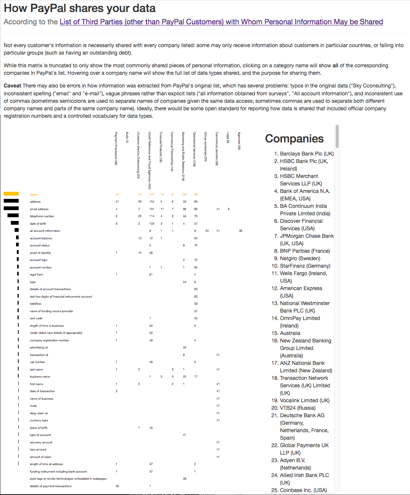

# PayPal Data Matrix visualization

This is a rough visualization of the [List of Third Parties (other than PayPal Customers) with Whom Personal Information May be Shared](https://www.paypal.com/ie/webapps/mpp/ua/third-parties-list) released by PayPal.

The script ``get_data.py`` tries to parse this HTML file, and produces a JSON file; ``index.html`` loads this and produces an interactive visualization using D3.

